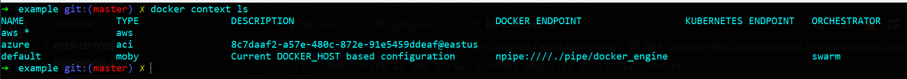

## Docker Compose Demo Application
Disclaimer: Some part of this demo application is taken from a demo which happened in WS Cloud Containers Conference on 2020-07-09. Rest part of the code is added to introduce more complexity in sample code

The application primary has three microservices
- Flask App
- Redis backend
- Celery based queue mechanism

Flask API & Celery service both talks to Redis backend and all of these three have to be deployed in separate containers.

### Create an AWS Docker context and list available contexts

To initialize the Docker ECS integration, you will need to run the `setup`
command. This will create a Docker context that works with AWS ECS.

```console
➜  example git:(master) ✗ docker ecs setup
Enter context name: aws
> new profile
Enter profile name: sandbox
Enter region: ap-southeast-1
Enter credentials: y
Enter AWS Access Key ID: *************************
Enter AWS Secret Access Key: ***************************
```

You can verify that the context was created by listing your Docker contexts:

```console
$ docker context ls
```


### Test locally

The first step is to test your application works locally. To do this, you will
need to switch to using the default local context so that you are targeting your
local machine.

```console
docker context use default
```

You can then run the application using `docker-compose`:

```console
docker-compose up
```

Once the application has started, you can navigate to http://localhost:5000
using your Web browser using the following command:

```console
open http://localhost:5000
```

Try out all the APIs are working file. Primarily there are two things to check - 

- localhost:5000 will be serving an HTML template, which will eventually to talk flask server and that talks to Redis bacekend
- Second thing to test is /download API, in which Flask App talks to celery service and sends a background task to take place

### Push images to Docker Hub for ECS (ECS cannot see your local image cache)

In order to run your application in the cloud, you will need your container
images to be in a registry. You can push them from your local machine using:

```console
docker-compose push
```

You can verify that this command pushed to the Docker Hub by
[logging in](https://hub.docker.com) and looking for the `timestamper`
repository under your user name.

### Switch to ECS context and launch the app

Now that you've tested the application works locally and that you've pushed the
container images to the Docker Hub, you can switch to using the `aws` context
you created earlier.

```console
docker context use aws
```

Running the application on ECS is then as simple as doing a `compose up`:

```console
docker ecs compose up
```

### Check out the CLI

Once the application is running in ECS, you can list the running containers with
the `ps` command. Note that you will need to run this from the directory where
you Compose file is.

```console
docker ecs compose ps
```

You can also read the application logs using `compose logs`:

```console
docker ecs compose logs
```

### Check out the AWS console

You can see all the AWS components created for your running application in the
AWS console. There you will find:

- CloudFormation being used to manage all the infrastructure
- CloudWatch for logs
- Security Groups for network policies
- Load balancers (ELB for this example / ALB if your app only uses 80/443)

### Checkout CloudFormation

The ECS Docker CLI integration has the ability to output the CloudFormation
template used to create the application in the `compose convert` command. You
can see this by running:

```console
docker ecs compose convert
```

### Stop the meters

To shut down your application, you simply need to run:

```console
docker ecs compose down
```

